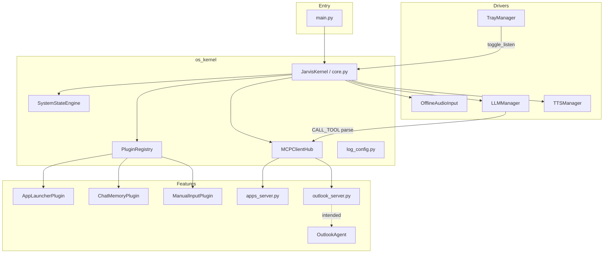

# Jarvis Codebase Analysis

**Generated:** 2026-06-04  
**Repository:** `c:\Personal\AI\Jarvis`  
**Purpose:** Local Windows voice assistant with microkernel-style routing, offline STT, Ollama LLM, MCP tool servers, and plugin extensibility.

---

## Executive Summary

Jarvis is a **single-user, on-premise desktop assistant** for Windows. Speech is captured locally, transcribed with **whisper.cpp**, commands are routed through a **four-layer pipeline** (context → plugin intercept → LLM/MCP tools → spoken reply), and responses are spoken via **Edge TTS** with in-process **pygame** playback. The design emphasizes **air-gapped STT/LLM** (internet only for TTS synthesis).

The codebase is **compact** (~35 Python modules, ~1,300 lines) and organized around a clear split: **`os_kernel/`** (orchestration), **`drivers/`** (I/O), **`plugins/`** (feature hooks), **`mcp_servers/`** (stdio MCP tool hosts), and **`agents/`** (OS automation workers).

**Overall maturity:** Solid scaffolding and documentation (`README.md`, `Jarvis.md`); several integration paths are **documented but not fully wired** (config system prompt, chat memory → LLM, dynamic temperature, Outlook MCP tools).

---

## Technology Stack

| Layer | Technology | Role |
|-------|------------|------|
| Runtime | Python 3.10+ (3.12 tested) | Async main loop + threaded tray |
| Config | PyYAML (`config.yaml`) | Assistant name, LLM model, TTS voice, audio paths, hotkeys |
| STT | whisper.cpp (`whisper-cli.exe`) + PyAudio/SpeechRecognition | Offline transcription |
| DSP | NumPy, SciPy (`butter` bandpass 80 Hz–8 kHz) | Noise reduction before Whisper |
| LLM | Ollama (`/api/chat` via `requests`) | Text + pseudo–tool-calling via `CALL_TOOL:` prompt format |
| TTS | edge-tts + pygame | Neural voice, local MP3 playback |
| UI | pystray, Pillow, keyboard | System tray + global hotkey |
| Automation | subprocess, pyautogui (agents), win32com (Outlook) | App launch & COM email |
| Protocol | MCP Python SDK (stdio JSON-RPC) | Tool discovery and execution |
| Console UX | Rich (panels, live MCP status table) | Boot dashboard |

**Not in `requirements.txt` but used:** `pywin32` (Outlook agent via `win32com.client`).

**Listed but lightly used:** `openai` package (README references OpenAI-style client; implementation uses raw Ollama HTTP).

---

## High-Level Architecture



---

## Repository Layout

```
Jarvis/
├── main.py                 # Entry: Windows selector loop, kernel boot, MCP shutdown
├── config.yaml             # Runtime settings (partially consumed)
├── requirements.txt
├── README.md               # Primary technical documentation
├── Jarvis.md               # User-facing capabilities & persona
├── JarvisConsole.md        # This analysis document
│
├── os_kernel/
│   ├── core.py             # JarvisKernel — main loop & routing
│   ├── plugin/plugin_registry.py
│   ├── mcp/mcp_client_hub.py
│   ├── agent/agent_manager.py   # Legacy registry (not used by core)
│   ├── temperature/system_states.py
│   ├── logs/log_config.py
│   └── skills/skills.md
│
├── drivers/
│   ├── audio.py            # Mic → DSP → WAV → whisper-cli
│   ├── llm.py              # Ollama chat + CALL_TOOL parsing
│   ├── tts.py              # Edge TTS + pygame
│   └── tray.py             # Hotkey + systray
│
├── plugins/
│   ├── app_launcher/       # Layer B: phrase-matched app opens
│   ├── chat_memory/        # Layer A: rolling history (5 turns)
│   └── manual_input/       # Keyboard override (T key, 2s window)
│
├── mcp_servers/
│   ├── apps_server.py      # open_application tool (Chrome, Outlook, etc.)
│   └── outlook_server.py   # STUB — tools not implemented
│
├── agents/
│   └── outlook_agent.py    # COM-based Outlook draft (unused without MCP tools)
│
├── models/                 # ggml-tiny.en.bin (gitignored)
├── whisper_bin/            # whisper-cli + DLLs (gitignored)
└── logs/                   # Rotating error logs (gitignored *.log)
```

**Tracked source files (approx.):** 43 paths in repo listing; **35 `.py` files**, **~1,298 lines** of Python.

---

## Boot & Runtime Lifecycle

1. **`main.py`** sets `WindowsSelectorEventLoopPolicy`, installs global exception hook, runs `JarvisKernel.boot_up()`.
2. **`JarvisKernel.__init__`** loads `config.yaml`, constructs brain/voice/plugins/MCP hub/state engine, discovers plugins, starts tray thread.
3. **`boot_up()`** clears console, prints Rich welcome panel, live-updates MCP connection table while `MCPClientHub.connect_servers()` spawns stdio subprocesses for each `mcp_servers/*_server.py`.
4. **`run()`** validates Whisper binary/DLLs/model, then loops while `self.running`:
   - When `should_listen` is true (tray/hotkey): optional keyboard override → else `listen_and_transcribe()`.
   - Non-empty text → `process_user_input()`.
5. **Shutdown:** `main.py` finally block calls `mcp_hub.shutdown()`; `run()` also shuts down MCP in its `finally`.

**Default state:** Listening is **off** until user presses **Ctrl+1** (configurable) or tray *Toggle Listening*.

---

## Request Processing Pipeline

Every user utterance (voice or typed) flows through `JarvisKernel.process_user_input()`:

| Step | Layer | Mechanism | Outcome |
|------|-------|-----------|---------|
| 0 | Control | `"exit"` / `"shutdown"` | Stops kernel, speaks goodbye |
| 1 | Skills FAQ | `_is_skills_inquiry()` | Reads `os_kernel/skills/skills.md` aloud |
| 2 | **A — Context** | `plugins.inject_context()` | Builds `llm_context["messages"]` (memory plugin appends history) |
| 3 | **B — Intercept** | `plugins.try_intercept()` | First non-`None` reply wins (e.g. app launcher) |
| 4 | **C — State** | `SystemStateEngine.evaluate_runtime_parameters()` | Chooses temperature label (see gaps below) |
| 5 | **C — LLM + MCP** | `brain.generate_tool_aware_response()` + `mcp_hub.call_tool()` | Parses `CALL_TOOL:` from model text; executes MCP tool; speaks result |
| 6 | **D — Dialogue** | Plain text reply + `ChatMemoryPlugin.update_memory()` | Speaks LLM text; stores turn |

**Plugin contract:** Classes named `*Plugin` in `plugins/<package>/`, exported from package `__init__.py`. `execute(user_text, context=None)` returns a string to intercept when `context is None`; when `context` is provided, plugins may mutate context only.

---

## Core Components

### `JarvisKernel` (`os_kernel/core.py`)

- Central orchestrator: config, plugins, MCP, TTS, LLM, tray, Rich boot UI.
- **MCP status table** maps filenames to display names (`apps_server.py` → System-Apps-Server, etc.).
- **Error handling:** Broad `try/except` around `process_user_input` logs to `logs/Jarvis/jarvis.log`.
- **Does not use:** `AgentManager`, `config["assistant"]["system_prompt"]`, injected `llm_context` messages in LLM calls.

### `PluginRegistry` (`os_kernel/plugin/plugin_registry.py`)

- Auto-discovers subpackages under `plugins/` via `pkgutil.iter_modules`.
- Instantiates every type ending in `Plugin`.
- Named accessors: `.memory` → `ChatMemoryPlugin`, `.manual_input` → `ManualInputPlugin`.

**Mounted plugins (expected at runtime):**

| Plugin | Role |
|--------|------|
| `AppLauncherPlugin` | Matches phrases in `plugins/app_launcher/commands/*.py` (`MATCH` + `exec_command`) |
| `ChatMemoryPlugin` | Injects up to 5 turn-pairs into context; updates after LLM/MCP replies |
| `ManualInputPlugin` | 2s window to press `T` and type a command (Windows `msvcrt`) |

**App launcher commands:** Chrome, Notepad, Calculator, VS Code (via dedicated command modules).

### `MCPClientHub` (`os_kernel/mcp/mcp_client_hub.py`)

- Discovers `mcp_servers/*_server.py`, spawns each with current Python + `PYTHONPATH=PROJECT_ROOT`.
- Maintains long-lived `ClientSession` per server until shutdown.
- Aggregates `tools_manifest` for LLM system guidance.
- **`call_tool()`:** Fuzzy name match (strip `_`, spaces, case); lists tools per session on each call.
- Robust logging for `ExceptionGroup` / TaskGroup failures into `logs/mcp/<server>.log`.

**Active MCP servers:**

| Server | Tools | Status |
|--------|-------|--------|
| `apps_server.py` | `open_application` | **Functional** — subprocess `start` for Chrome, Outlook, Notepad, Calc, VS Code |
| `outlook_server.py` | *(none registered)* | **Stub** — FastMCP instance only; comment placeholder for tools |

### `SystemStateEngine` (`os_kernel/temperature/system_states.py`)

- Keyword-based states: MCP/email (0.0), code (0.2), creative (1.1), factual (0.3), default chat (0.7).
- Checks `is_mcp_awaiting` via `session.awaiting_confirmation` — **attribute never set** on MCP sessions.

### `AgentManager` (`os_kernel/agent/agent_manager.py`)

- Register/run/route pattern for legacy non-MCP agents.
- **Not referenced** from `JarvisKernel` — dead path for current architecture.

### Logging (`os_kernel/logs/log_config.py`)

- ERROR-level rotating logs: `logs/Jarvis/`, `logs/mcp/`, `logs/Agents/`.
- Global uncaught exception hook in `main.py`.

---

## Drivers

### Audio (`drivers/audio.py`)

- **Capture:** SpeechRecognition, 4s timeout, 8s phrase limit, ambient calibration once.
- **Pipeline:** Resample to 16 kHz mono → Butterworth bandpass → WAV → `whisper-cli -nt`.
- **Validation:** Binary, `ggml*.dll`, model file paths.
- **Artifact filter:** Ignores Whisper noise tags (`[blank]`, `[music]`, etc.).

### LLM (`drivers/llm.py`)

- Posts to `http://localhost:11434/api/chat` (hardcoded; **ignores** `config.yaml` `llm.url`).
- Injects tool list into system message; expects model to emit:
  ```
  CALL_TOOL: <name> | ARGUMENTS: {"key": "value"}
  ```
- Maps aliases: `stage_note`, `stage_email`, `open_application`.
- **Temperature:** Always sends `0.0` in payload — **ignores** `SystemStateEngine` output from kernel.
- **Greeting interceptor:** Short-circuits common hellos without calling Ollama.
- **Chat memory:** Not passed — only single-turn `system` + `user` messages.

### TTS (`drivers/tts.py`)

- Strips markdown for natural speech.
- Writes `temp_response.mp3`, plays via pygame, deletes file.

### Tray (`drivers/tray.py`)

- Daemon thread: pystray menu + `keyboard` global hotkey.
- 0.5s debounce on toggle to avoid double-press flip.

---

## Agents

### `OutlookAgent` (`agents/outlook_agent.py`)

- Uses **Outlook COM** (`win32.Dispatch`) to create display-only mail item.
- Expects `{"recipient", "body"}` dict in `run()`.
- **Blocked upstream:** `outlook_server.py` does not expose `@server.tool()` handlers, so LLM cannot reach this agent via MCP today.

---

## Configuration (`config.yaml`)

| Key | Used by kernel? | Notes |
|-----|-----------------|-------|
| `assistant.name` | No | Display/docs only |
| `assistant.system_prompt` | **No** | Not loaded into `LLMManager` |
| `llm.model` | Yes | Passed to `LLMManager` |
| `llm.url` | **No** | Hardcoded Ollama URL in driver |
| `tts.voice` | Yes | |
| `audio.model_path` / `bin_path` | Yes | |
| `hotkeys.toggle_listen` | Yes | TrayManager |

---

## Dependencies (`requirements.txt`)

Core runtime: `edge-tts`, `mcp`, `keyboard`, `numpy`, `openai`, `pillow`, `pyautogui`, `PyAudio`, `pygame`, `PyYAML`, `rich`, `requests`, `pystray`, `scipy`, `SpeechRecognition`.

**Gap:** Outlook automation needs **`pywin32`** — install separately or builds fail on email agent import.

**External binaries (not in git):**

- `whisper_bin/whisper-cli.exe` + `ggml*.dll`
- `models/ggml-tiny.en.bin`
- Ollama service with tool-capable model (e.g. `llama3.2:3b`)

---

## Duplication & Overlap

| Capability | Plugin path | MCP path |
|------------|-------------|----------|
| Open Chrome / Notepad / Calc | `AppLauncherPlugin` (phrase match) | `apps_server.open_application` (LLM `CALL_TOOL`) |
| Open VS Code | Plugin command module | MCP `open_application` |
| Open Outlook | — | MCP only |
| Email staging | Documented / LLM alias `stage_email` | **Missing** MCP tools |

Plugins run **before** LLM; MCP tools require model to emit `CALL_TOOL`. Two parallel strategies increase maintenance surface.

---

## Strengths

1. **Clear architectural story** — microkernel, layered plugins, MCP as extension bus; well-documented in README.
2. **Privacy posture** — local STT and LLM; explicit “air-gapped” messaging.
3. **Production-minded audio path** — DLL validation, DSP filter, artifact suppression, mic retry.
4. **MCP hub quality** — PYTHONPATH injection, live connection dashboard, structured MCP error logging.
5. **Graceful async shutdown** — shutdown event, task cancellation, duplicate shutdown guards.
6. **Extensibility** — drop-in plugins and `*_server.py` pattern are easy to follow.

---

## Gaps, Risks & Technical Debt

### Critical / functional

| Issue | Impact |
|-------|--------|
| `outlook_server.py` is a **stub** (no `@server.tool`) | Email workflow in README/Jarvis.md **non-functional** via MCP |
| `pywin32` not in requirements | Outlook agent import fails if user adds tools later |
| Chat memory injected into `llm_context` but **never sent** to Ollama | Multi-turn chat **does not work** as documented |
| `config.yaml` `system_prompt` unused | Persona/honesty rules not enforced in LLM |

### Design inconsistencies

| Issue | Detail |
|-------|--------|
| Dynamic temperature | `SystemStateEngine` computes values; `LLMManager` **always uses 0.0** |
| `is_mcp_awaiting` | Reads nonexistent `awaiting_confirmation` on sessions |
| `AgentManager` | Implemented but unused in main flow |
| README vs code | References `notepad_server.py`, OpenAI client examples — not present / not used |
| `openai` dependency | Unused in current `LLMManager` implementation |

### Operational

| Issue | Detail |
|-------|--------|
| TTS requires network | Only non-local dependency during normal use |
| `temp_response.mp3` | Runtime artifact; gitignored |
| Small model (`llama3.2:3b`) | May struggle with reliable `CALL_TOOL:` formatting |
| Windows-only paths | `msvcrt`, `cmd /c start`, COM Outlook — not portable |

### Security notes

- `subprocess` / `shell=True` for app launch — expected for desktop automation; scope is user desktop.
- No authentication layer (single-user local app).

---

## Data & Control Flow (Single Command)

```
Ctrl+1 → should_listen=True
  → ManualInputPlugin.check_for_keyboard_override() [optional]
  → OfflineAudioInput.listen_and_transcribe()
  → process_user_input(text)
       → plugins.inject_context (memory → llm_context, unused by LLM)
       → plugins.try_intercept (e.g. "open chrome" → speak & return)
       → state_engine.evaluate_runtime_parameters (logged only)
       → LLMManager.generate_tool_aware_response(manifest)
            → if CALL_TOOL → MCPClientHub.call_tool → speak
            → else → speak text → memory.update_memory
```

---

## Extension Guide (Verified Patterns)

### Add a plugin

1. Create `plugins/my_feature/` with `handler.py` defining `class MyFeaturePlugin`.
2. Export from `plugins/my_feature/__init__.py`.
3. Implement `execute(self, user_text, context=None)` → return `str` to intercept, or mutate `context` when provided.

### Add an MCP tool

1. Add `mcp_servers/my_feature_server.py` with FastMCP + `@server.tool()` + `server.run(transport="stdio")`.
2. Delegate heavy OS work to `agents/my_feature_agent.py`.
3. Restart Jarvis — hub auto-discovers file.

### Wire LLM to config and memory (recommended fixes)

- Pass `self.config["assistant"]["system_prompt"]` and `llm_context["messages"]` into `generate_tool_aware_response`.
- Use `temperature=target_temp` from `SystemStateEngine` in Ollama `options`.
- Complete `outlook_server.py` tools (`stage_email`, confirmation flow) per README.

---

## Related Documentation

| File | Audience |
|------|----------|
| `README.md` | Developers — install, architecture, troubleshooting |
| `Jarvis.md` | End users — capabilities, persona, limits |
| `os_kernel/skills/skills.md` | Spoken “what can you do” handbook |

---

## Metrics Snapshot

| Metric | Value |
|--------|-------|
| Python modules | ~35 |
| Python LOC | ~1,298 |
| Plugins | 3 |
| MCP servers (files) | 2 (1 functional, 1 stub) |
| Agents | 1 |
| App launcher commands | 4+ modules |
| Config keys partially wired | ~4 of 7 |

---

## Recommended Priorities

1. **Restore Outlook MCP server** — implement `stage_email` / confirm tools calling `OutlookAgent`.
2. **Wire chat memory + system prompt** into `LLMManager` payload.
3. **Align temperature** — either honor `SystemStateEngine` or remove dead code paths.
4. **Add `pywin32` to requirements** (Windows extra) or guard Outlook agent import.
5. **Consolidate app launch** — choose plugin-first or MCP-first to reduce dual paths.
6. **Use `config.yaml` `llm.url`** in `LLMManager` for environment flexibility.

---

## Conclusion

Jarvis is a **well-structured prototype-to-product** local assistant with a coherent microkernel mental model, strong audio/MCP infrastructure, and good documentation. The **happy path** works for: tray/hotkey listening, offline transcription, plugin-based app launch, MCP `open_application`, and general Ollama chat with spoken replies.

The largest **documentation–implementation drift** is around **email/MCP tooling**, **multi-turn memory**, and **configuration-driven LLM behavior**. Addressing the items in Recommended Priorities would bring runtime behavior in line with `README.md` and `Jarvis.md` without changing the overall architecture.

---

*End of Jarvis Console analysis.*
