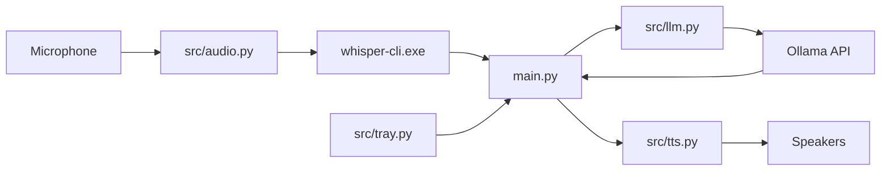

# Abhi-Voice (Jarvis)

A local voice assistant for Windows that runs entirely on your machine. It listens through your microphone, transcribes speech offline with **whisper.cpp**, reasons with **Ollama** (`llama3.2:1b`), and speaks back using **Edge TTS** — all controlled from the system tray.

## Features

- **Offline speech-to-text** via whisper.cpp (no cloud STT, no ffmpeg required)
- **Local LLM** via Ollama with a configurable system prompt
- **Natural text-to-speech** via Microsoft Edge voices (edge-tts)
- **System tray integration** with global hotkey toggle
- **In-process audio playback** using pygame (no media player popups on Windows)
- **Modular design** — audio, LLM, TTS, and tray are separate modules

## Architecture



**Flow**

1. Press **Ctrl+1** (or use the tray menu) to enable listening.
2. Microphone audio is captured and saved as a temporary WAV file.
3. `whisper-cli.exe` transcribes the audio locally.
4. The transcript is sent to Ollama through the OpenAI-compatible API.
5. The reply is synthesized with edge-tts and played through pygame.

## Project Structure

```
Abhi-Voice/
├── main.py              # Entry point and main async loop
├── config.yaml          # Assistant, LLM, TTS, audio, and hotkey settings
├── requirements.txt     # Python dependencies
├── models/              # Whisper GGML model files (not committed)
│   └── ggml-tiny.en.bin
├── whisper_bin/         # whisper.cpp Windows binaries (not committed)
│   ├── whisper-cli.exe
│   ├── whisper.dll
│   ├── ggml.dll
│   ├── ggml-base.dll
│   ├── ggml-cpu.dll
│   └── SDL2.dll
└── src/
    ├── audio.py         # Offline mic input + whisper.cpp transcription
    ├── llm.py           # Ollama / OpenAI client wrapper
    ├── tts.py           # Edge TTS + pygame playback
    └── tray.py          # System tray icon, menu, and global hotkey
```

## Prerequisites

| Requirement | Purpose |
|-------------|---------|
| **Python 3.10+** | Runtime (tested on 3.12) |
| **Ollama** | Local LLM server |
| **Microphone** | Speech input |
| **Internet** | Edge TTS synthesis only (STT and LLM are local) |

## Installation

### 1. Clone and install Python dependencies

```powershell
cd Abhi-Voice
python -m venv .venv
.venv\Scripts\activate
pip install -r requirements.txt
```

**PyAudio on Windows:** If `pip install PyAudio` fails, install a prebuilt wheel:

```powershell
pip install pipwin
pipwin install pyaudio
```

### 2. Set up Ollama

Install [Ollama](https://ollama.com), then pull the model:

```powershell
ollama pull llama3.2:1b
ollama serve
```

Verify it is running at `http://localhost:11434`.

### 3. Set up whisper.cpp (offline STT)

#### a) Download binaries

Download **[whisper-bin-x64.zip](https://github.com/ggml-org/whisper.cpp/releases)** from the whisper.cpp releases page.

Extract **all files** into `whisper_bin/` — not just `whisper-cli.exe`. The following DLLs are required:

- `whisper-cli.exe`
- `whisper.dll`
- `ggml.dll`
- `ggml-base.dll`
- `ggml-cpu.dll`
- `SDL2.dll`

> **Important:** Copying only the `.exe` will cause silent failures or "Unknown error" / missing DLL errors.

#### b) Download the Whisper model

Download `ggml-tiny.en.bin` from the [whisper.cpp models](https://huggingface.co/ggerganov/whisper.cpp/tree/main) collection and place it in `models/`.

For better accuracy (slower), use `ggml-base.en.bin` and update `config.yaml`.

## Configuration

All settings live in `config.yaml`:

```yaml
assistant:
  name: "Jarvis"
  system_prompt: "You are Jarvis, a brilliant, helpful, and witty AI assistant. Keep responses brief (1-2 sentences)."

llm:
  model: "llama3.2:1b"
  url: "http://localhost:11434/v1"

tts:
  voice: "en-US-BrianNeural"

audio:
  model_path: "models/ggml-tiny.en.bin"
  bin_path: "whisper_bin/whisper-cli.exe"

hotkeys:
  toggle_listen: "ctrl+1"
```

| Key | Description |
|-----|-------------|
| `assistant.system_prompt` | Personality and response length for the LLM |
| `llm.model` | Ollama model name |
| `llm.url` | Ollama OpenAI-compatible API base URL |
| `tts.voice` | Edge TTS voice ID ([voice list](https://speech.platform.bing.com/consumer/speech/synthesize/readaloud/voices/list?trustedclienttoken=6A5AA1D4EAFF4E9FB37E23D68491D6F4)) |
| `audio.model_path` | Path to GGML Whisper model |
| `audio.bin_path` | Path to whisper-cli executable |
| `hotkeys.toggle_listen` | Global hotkey to start/stop listening |

## Usage

Run from the project root:

```powershell
python main.py
```

Jarvis starts in the background with a system tray icon.

| Action | How |
|--------|-----|
| **Start / stop listening** | Press **Ctrl+1** or tray menu → *Toggle Listening* |
| **Exit** | Tray menu → *Exit Jarvis*, or **Ctrl+C** in the terminal |
| **View logs** | Watch the terminal for `You:` and `Jarvis:` lines |

Listening is **off by default**. Press **Ctrl+1** once after startup, wait for `[Jarvis Core: Monitoring Mic Input...]`, then speak.

## Module Reference

### `src/audio.py` — `OfflineAudioInput`

Handles microphone capture and offline transcription.

- Captures audio with `speech_recognition` (4 s timeout, 8 s phrase limit)
- Converts to 16 kHz mono WAV using Python stdlib (`audioop` + `wave`) — no ffmpeg
- Invokes `whisper-cli.exe` as a subprocess
- Validates binary, DLLs, and model on startup

### `src/llm.py` — `LLMManager`

Connects to Ollama via the OpenAI Python client.

```python
llm = LLMManager(base_url="http://localhost:11434/v1", model="llama3.2:1b")
reply = llm.generate_response(user_text, system_instruction)
```

### `src/tts.py` — `TTSManager`

Generates speech with edge-tts and plays it in-process with pygame.

```python
tts = TTSManager(voice="en-US-BrianNeural")
await tts.speak("Hello, sir.")
```

### `src/tray.py` — `TrayManager`

Runs the system tray icon and global hotkey in a background thread. Includes a 0.5 s debounce to prevent accidental double-toggles.

## Troubleshooting

### `Setup incomplete. Whisper binary or model file is missing`

- Ensure `whisper_bin/whisper-cli.exe` exists
- Ensure `models/ggml-tiny.en.bin` exists
- Extract the **full** `whisper-bin-x64.zip` into `whisper_bin/`

### `[Whisper error: Unknown error]` or missing DLL

Whisper crashed before producing output. Re-extract the complete release zip so all `ggml*.dll` files are present alongside `whisper-cli.exe`.

### `[Whisper setup error: [WinError 2] The system cannot find the file specified]`

Usually caused by a missing ffmpeg dependency in older versions. Current code uses stdlib audio conversion and should not require ffmpeg. If you still see this, verify `whisper-cli.exe` exists and run `python main.py` from the project root.

### `main.exe is deprecated`

Use `whisper-cli.exe` from the official release. Do not use `main.exe`.

### Listening toggles off immediately

Press **Ctrl+1** once and wait — a double-press toggles on then off. The tray module debounces rapid repeats.

### No transcription / empty results

- Speak clearly after `[Jarvis Core: Monitoring Mic Input...]` appears
- Reduce background noise
- Try a larger model (`ggml-base.en.bin`) for better accuracy

### `Error connecting to Ollama`

- Confirm Ollama is running: `ollama serve`
- Confirm the model is pulled: `ollama pull llama3.2:1b`
- Check `llm.url` in `config.yaml`

### TTS fails or no audio

- Edge TTS requires internet access
- Check speakers / system volume
- Try a different voice in `config.yaml`

### PyAudio / microphone errors

- Allow microphone access in Windows Settings → Privacy → Microphone
- Ensure no other app has exclusive control of the mic

## Development

```powershell
# Syntax check
python -m py_compile main.py src/*.py

# Validate whisper setup without running the full assistant
python -c "from src.audio import OfflineAudioInput; OfflineAudioInput().validate(); print('OK')"
```

## License

This project integrates third-party tools with their own licenses:

- [whisper.cpp](https://github.com/ggml-org/whisper.cpp) — MIT
- [Ollama](https://ollama.com) — See Ollama terms
- [edge-tts](https://github.com/rany2/edge-tts) — See project license
