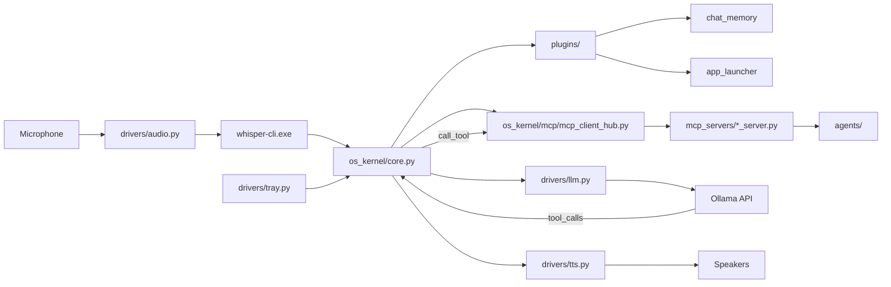

# Abhishek's Voice Assistant (Jarvis)

A local voice assistant for Windows that runs entirely on your machine. It listens through your microphone, transcribes speech offline with **whisper.cpp**, routes commands through a **plugin registry**, connects to official **MCP (Model Context Protocol)** servers as a client, reasons with **Ollama** via function-calling, and speaks back using **Edge TTS** — all controlled from the system tray.

## Features

- **Offline speech-to-text** via whisper.cpp (no cloud STT, no ffmpeg required)
- **Local LLM** via Ollama with a configurable system prompt and tool-calling support
- **MCP client hub** — auto-discovers and spawns stdio MCP servers from `mcp_servers/`
- **Agent workers** — decoupled OS automation tasks (Notepad, Outlook, etc.) in `agents/`
- **Plugin registry** — auto-discovers feature plugins from `plugins/`
- **Short-term chat memory** — rolling conversation context via `ChatMemoryPlugin`
- **App launcher** — open Windows apps by voice via `AppLauncherPlugin`
- **Keyboard override** — press `T` during the listen window to type a command instead of speaking
- **Natural text-to-speech** via Microsoft Edge voices (edge-tts)
- **System tray integration** with global hotkey toggle
- **In-process audio playback** using pygame (no media player popups on Windows)

## Architecture



**Pipeline (per voice command)**

1. Press **Ctrl+1** (or tray menu) to enable listening.
2. Mic audio is captured and transcribed locally by whisper.cpp (or press **T** to type a command).
3. **Layer A — Context:** plugins inject data (e.g. chat history into LLM context).
4. **Layer B — Intercept:** plugins handle commands locally (e.g. "open notepad").
5. **Layer C — LLM + MCP:** unmatched input goes to Ollama with the live MCP tool manifest. If the model returns a structured tool call, the kernel executes it via `MCPClientHub.call_tool()` and speaks the result (e.g. a confirmation prompt).
6. **Layer D — Dialogue:** if no tool is invoked, the model's text reply is spoken normally; the memory plugin saves the exchange.

## Project Structure

```
Jarvis/
├── main.py                      # Entry point — boots JarvisKernel
├── config.yaml                  # Assistant, LLM, TTS, audio, and hotkey settings
├── requirements.txt
├── os_kernel/                   # Microkernel core
│   ├── core.py                  # JarvisKernel — main async loop and routing
│   ├── __init__.py
│   ├── agent/
│   │   └── agent_manager.py     # Agent worker registry (legacy routing)
│   ├── logs/
│   │   └── log_config.py        # Structured logging for kernel, MCP, agents
│   ├── mcp/
│   │   └── mcp_client_hub.py    # MCP client — spawns servers, aggregates tools
│   ├── plugin/
│   │   └── plugin_registry.py   # Auto-discovers and mounts plugins
│   ├── skills/
│   │   └── skills.md            # Custom skills handbook injected into LLM context
│   └── temperature/
│       └── system_states.py     # Dynamic LLM temperature state engine
├── drivers/                     # Hardware / I/O drivers
│   ├── audio.py                 # Offline mic input + whisper.cpp
│   ├── llm.py                   # Ollama / OpenAI client wrapper + tool calling
│   ├── tts.py                   # Edge TTS + pygame playback
│   └── tray.py                  # System tray icon, menu, global hotkey
├── mcp_servers/                         # Official stdio MCP server scripts
│   ├── notepad_server.py        # stage_note / confirm_and_open_notepad tools
│   └── outlook_server.py        # stage_email / confirm_and_send_email tools
├── agents/                      # Decoupled OS automation workers
│   ├── notepad_agent.py         # Launches Notepad and types staged text
│   └── outlook_agent.py         # Opens Outlook and composes staged email
├── plugins/                     # Feature plugin registry
│   ├── app_launcher/
│   ├── chat_memory/
│   └── manual_input/
├── models/                      # Whisper GGML models (not committed)
│   └── ggml-tiny.en.bin
└── whisper_bin/                 # whisper.cpp Windows binaries (not committed)
    ├── whisper-cli.exe
    └── *.dll
```

## Prerequisites

| Requirement | Purpose |
|-------------|---------|
| **Python 3.10+** | Runtime (tested on 3.12) |
| **Ollama** | Local LLM server (must support tool/function calling) |
| **Microphone** | Speech input |
| **Internet** | Edge TTS synthesis only (STT and LLM are local) |

## Installation

### 1. Clone and install Python dependencies

```powershell
cd "Jarvis"
python -m venv .venv
.venv\Scripts\activate
pip install -r requirements.txt
```

**PyAudio on Windows:** If `pip install PyAudio` fails:

```powershell
pip install pipwin
pipwin install pyaudio
```

### 2. Set up Ollama

```powershell
ollama pull llama3.2:1b
ollama serve
```

Verify at `http://localhost:11434`.

### 3. Set up whisper.cpp (offline STT)

Download **[whisper-bin-x64.zip](https://github.com/ggml-org/whisper.cpp/releases)** and extract **all files** into `whisper_bin/`.

Download `ggml-tiny.en.bin` from [whisper.cpp models](https://huggingface.co/ggerganov/whisper.cpp/tree/main) into `models/`.

> Copying only `whisper-cli.exe` causes missing DLL errors. Extract the full zip.

## Configuration

```yaml
assistant:
  name: "Jarvis"
  system_prompt: |
    You are Jarvis, a localized desktop AI assistant running on a Microkernel Architecture.
    You must be completely honest about your capabilities.

llm:
  model: "llama3.2:1b"
  url: "http://localhost:11434/v1"

tts:
  voice: "en-US-BrianNeural"

audio:
  model_path: "models/ggml-tiny.en.bin"
  bin_path: "whisper_bin/whisper-cli.exe"

hotkeys:
  toggle_listen: "ctrl+1"
```

## Usage

```powershell
python main.py
```

On startup the kernel spawns all MCP servers in `mcp_servers/`, pulls their tool manifests, and announces readiness.

| Action | How |
|--------|-----|
| **Start / stop listening** | **Ctrl+1** or tray → *Toggle Listening* |
| **Exit** | Tray → *Exit Jarvis*, say "exit"/"shutdown", or **Ctrl+C** |
| **Type instead of speak** | Press **T** during the 2-second listen window |
| **Open an app** | "Open notepad" / "Launch chrome" (via `AppLauncherPlugin`) |
| **Write a note** | "Write a note saying …" — LLM calls `stage_note`, then confirm to execute |
| **Draft an email** | "Email Sarah about the meeting" — LLM calls `stage_email`, then confirm to send |
| **Multi-turn chat** | Ask a question, then a follow-up — memory plugin keeps context |

Listening is **off by default**. Press **Ctrl+1** once, wait for the mic monitoring prompt, then speak.

## MCP Client Hub

The kernel acts as an **MCP client**. At boot, `MCPClientHub` scans `mcp_servers/` for `*_server.py` scripts, spawns each as a stdio sub-process, and aggregates their tool schemas into `tools_manifest`.

When the LLM decides a tool is needed, it returns a structured call. The kernel executes it:

```
User speech → Ollama (with tools_manifest) → tool_call → mcp_hub.call_tool() → TTS speaks result
```

### Creating an MCP server

Add a new file to `mcp_servers/` using FastMCP:

```python
# mcp_servers/my_feature_server.py
from mcp.server.fastmcp import FastMCP
from agents.my_feature_agent import MyFeatureAgent

server = FastMCP("MyFeature-Server")
worker = MyFeatureAgent()

@server.tool()
async def do_something(payload: str) -> str:
    """Describe what this tool does for the LLM."""
    return worker.run(payload)

if __name__ == "__main__":
    server.run(transport="stdio")
```

Restart Jarvis — the hub will auto-discover and register the new tools.

## Agent Workers

Agents in `agents/` contain the actual OS automation logic (subprocess launches, pyautogui typing, etc.). MCP servers delegate to agents; the kernel never calls agents directly.

```
LLM → MCP server tool → Agent.run(payload) → physical OS action
```

### Creating an agent

```python
# agents/my_feature_agent.py
class MyFeatureAgent:
    def run(self, payload):
        # Perform the OS task
        return "Done, sir."
```

## Plugin System

Plugins live in `plugins/<name>/` and expose a class ending in `Plugin`. The kernel auto-discovers and mounts them at startup.

### Creating a plugin

```
plugins/my_feature/
├── __init__.py      # from .handler import MyFeaturePlugin
└── handler.py       # class MyFeaturePlugin
```

```python
class MyFeaturePlugin:
    def execute(self, user_text, context=None):
        # Return a spoken reply string to intercept the command (Layer B)
        # Or modify context["messages"] for LLM injection (Layer A)
        return None
```

Export the class from `__init__.py`. Restart Jarvis — it will appear in the startup log:

```
[Kernel: Indexing decentralized features...]
 -> Successfully mounted plugin: MyFeaturePlugin
```

### Built-in plugins

| Plugin | File | Role |
|--------|------|------|
| `ChatMemoryPlugin` | `plugins/chat_memory/memory.py` | Injects rolling chat history; saves turns after LLM replies |
| `AppLauncherPlugin` | `plugins/app_launcher/launcher.py` | Opens Chrome, Notepad, Calculator, Explorer on "open/launch" |
| `ManualInputPlugin` | `plugins/manual_input/input_handler.py` | Press **T** to type a command instead of speaking |

## Module Reference

### `drivers/audio.py` — `OfflineAudioInput`

- Captures mic audio (4 s timeout, 8 s phrase limit)
- Converts to 16 kHz mono WAV via stdlib (`audioop` + `wave`) — no ffmpeg
- Runs `whisper-cli.exe` as subprocess
- `validate()` checks binary, DLLs, and model at startup

### `drivers/llm.py` — `LLMManager`

```python
llm = LLMManager(base_url="http://localhost:11434/v1", model="llama3.2:1b")

# Standard chat
reply = llm.generate_response(messages_payload)

# Tool-aware (MCP function calling with dynamic temperature)
response = llm.generate_tool_aware_response(
    user_text,
    tools_manifest,
    temperature=0.0,
)
if response.tool_calls:
    for call in response.tool_calls:
        print(call.name, call.arguments)
else:
    print(response.text)
```

### `drivers/tts.py` — `TTSManager`

```python
await TTSManager(voice="en-US-BrianNeural").speak("Hello, sir.")
```

### `drivers/tray.py` — `TrayManager`

System tray icon + global hotkey with 0.5 s debounce.

### `os_kernel/core.py` — `JarvisKernel`

Main engine: manages audio, voice, brain, plugins, MCP client hub, runtime temperature tuning, and the async event loop.

### `os_kernel/mcp/mcp_client_hub.py` — `MCPClientHub`

Discovers `mcp_servers/*_server.py` servers, spawns stdio sub-processes, aggregates tool manifests, and routes `call_tool()` requests.

### `os_kernel/plugin/plugin_registry.py` — `PluginRegistry`

Auto-discovers and mounts feature plugins from `plugins/`.

### `os_kernel/agent/agent_manager.py` — `AgentManager`

Legacy agent worker registry for handle-based routing outside MCP.

### `os_kernel/logs/log_config.py` — logging helpers

Structured rotating log files under `logs/Jarvis/`, `logs/mcp/`, and `logs/Agents/`.

### `os_kernel/temperature/system_states.py` — `SystemStateEngine`

Evaluates user intent and MCP confirmation state to pick an optimal LLM temperature per turn.

### `os_kernel/skills/skills.md` — skills handbook

Custom capability profile injected into the LLM system context at startup.

## Troubleshooting

### Setup incomplete / missing Whisper files

Extract the full `whisper-bin-x64.zip` into `whisper_bin/` and place `ggml-tiny.en.bin` in `models/`.

### `[Whisper error: Unknown error]` or missing DLL

Re-extract all `ggml*.dll` files alongside `whisper-cli.exe`.

### `[Whisper setup error: [WinError 2]]`

Verify `whisper-cli.exe` exists and run `python main.py` from the project root.

### Listening toggles off immediately

Press **Ctrl+1** once and wait — double-press toggles off. Tray debounces rapid repeats.

### `Error connecting to Ollama`

Run `ollama serve`, pull the model, and check `llm.url` in `config.yaml`.

### No plugins mounted

Ensure each plugin folder has `__init__.py` exporting a `*Plugin` class.

### No MCP tools compiled at startup

Ensure MCP server scripts live in `mcp_servers/` and are named `*_server.py`. Each must include `if __name__ == "__main__": server.run(transport="stdio")`.

### Tool call fails / no OS action

Check that the corresponding agent in `agents/` is implemented and that Ollama returned a valid tool call. Review logs in `logs/Agents/` and `logs/mcp/`.

## Development

```powershell
python -m py_compile main.py
python -c "from drivers.audio import OfflineAudioInput; OfflineAudioInput('models/ggml-tiny.en.bin', 'whisper_bin/whisper-cli.exe').validate(); print('OK')"
python -c "from os_kernel import JarvisKernel; print(JarvisKernel)"
```

## License

- [whisper.cpp](https://github.com/ggml-org/whisper.cpp) — MIT
- [Ollama](https://ollama.com) — See Ollama terms
- [edge-tts](https://github.com/rany2/edge-tts) — See project license
- [MCP SDK](https://github.com/modelcontextprotocol/python-sdk) — See project license
