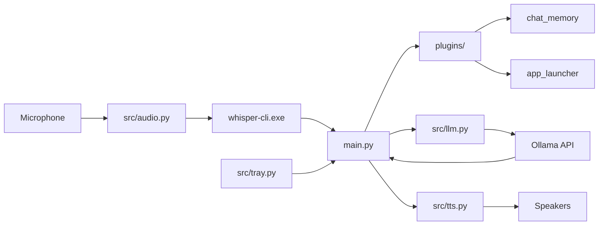

# Abhi-Voice (Jarvis)

A local voice assistant for Windows that runs entirely on your machine. It listens through your microphone, transcribes speech offline with **whisper.cpp**, routes commands through a **plugin registry**, reasons with **Ollama** (`llama3.2:1b`), and speaks back using **Edge TTS** — all controlled from the system tray.

## Features

- **Offline speech-to-text** via whisper.cpp (no cloud STT, no ffmpeg required)
- **Local LLM** via Ollama with a configurable system prompt
- **Plugin registry** — auto-discovers feature plugins from `plugins/`
- **Short-term chat memory** — rolling conversation context via `ChatMemoryPlugin`
- **App launcher** — open Windows apps by voice via `AppLauncherPlugin`
- **Natural text-to-speech** via Microsoft Edge voices (edge-tts)
- **System tray integration** with global hotkey toggle
- **In-process audio playback** using pygame (no media player popups on Windows)

## Architecture



**Pipeline (per voice command)**

1. Press **Ctrl+1** (or tray menu) to enable listening.
2. Mic audio is captured and transcribed locally by whisper.cpp.
3. **Layer A — Context:** plugins inject data (e.g. chat history into LLM context).
4. **Layer B — Intercept:** plugins handle commands locally (e.g. "open notepad").
5. **Layer C — LLM:** unmatched input goes to Ollama; memory plugin saves the exchange.

## Project Structure

```
Abhi-Voice/
├── main.py                  # Entry point, plugin discovery, async loop
├── config.yaml              # Assistant, LLM, TTS, audio, and hotkey settings
├── requirements.txt
├── models/                  # Whisper GGML models (not committed)
│   └── ggml-tiny.en.bin
├── whisper_bin/             # whisper.cpp Windows binaries (not committed)
│   ├── whisper-cli.exe
│   ├── whisper.dll
│   ├── ggml.dll
│   ├── ggml-base.dll
│   ├── ggml-cpu.dll
│   └── SDL2.dll
├── plugins/                 # Feature plugin registry
│   ├── app_launcher/
│   │   ├── __init__.py
│   │   └── launcher.py      # AppLauncherPlugin
│   └── chat_memory/
│       ├── __init__.py
│       └── memory.py        # ChatMemoryPlugin
└── src/
    ├── audio.py             # Offline mic input + whisper.cpp
    ├── llm.py               # Ollama / OpenAI client wrapper
    ├── tts.py               # Edge TTS + pygame playback
    └── tray.py              # System tray icon, menu, global hotkey
```

## Prerequisites

| Requirement | Purpose |
|-------------|---------|
| **Python 3.10+** | Runtime (tested on 3.12) |
| **Ollama** | Local LLM server |
| **Microphone** | Speech input |
| **Internet** | Edge TTS synthesis only (STT and LLM are local) |

## Installation

### 1. Clone and install Python dependencies

```powershell
cd Abhi-Voice
python -m venv .venv
.venv\Scripts\activate
pip install -r requirements.txt
```

**PyAudio on Windows:** If `pip install PyAudio` fails:

```powershell
pip install pipwin
pipwin install pyaudio
```

### 2. Set up Ollama

```powershell
ollama pull llama3.2:1b
ollama serve
```

Verify at `http://localhost:11434`.

### 3. Set up whisper.cpp (offline STT)

Download **[whisper-bin-x64.zip](https://github.com/ggml-org/whisper.cpp/releases)** and extract **all files** into `whisper_bin/`.

Download `ggml-tiny.en.bin` from [whisper.cpp models](https://huggingface.co/ggerganov/whisper.cpp/tree/main) into `models/`.

> Copying only `whisper-cli.exe` causes missing DLL errors. Extract the full zip.

## Configuration

```yaml
assistant:
  name: "Jarvis"
  system_prompt: "You are Jarvis, a brilliant, helpful, and witty AI assistant. Keep responses brief (1-2 sentences)."

llm:
  model: "llama3.2:1b"
  url: "http://localhost:11434/v1"

tts:
  voice: "en-US-BrianNeural"

audio:
  model_path: "models/ggml-tiny.en.bin"
  bin_path: "whisper_bin/whisper-cli.exe"

hotkeys:
  toggle_listen: "ctrl+1"
```

## Usage

```powershell
python main.py
```

| Action | How |
|--------|-----|
| **Start / stop listening** | **Ctrl+1** or tray → *Toggle Listening* |
| **Exit** | Tray → *Exit Jarvis*, say "exit"/"shutdown", or **Ctrl+C** |
| **Open an app** | "Open notepad" / "Launch chrome" |
| **Multi-turn chat** | Ask a question, then a follow-up — memory plugin keeps context |

Listening is **off by default**. Press **Ctrl+1** once, wait for `[Jarvis Core: Monitoring Mic Input...]`, then speak.

## Plugin System

Plugins live in `plugins/<name>/` and expose a class ending in `Plugin`. `main.py` auto-discovers and mounts them at startup.

### Creating a plugin

```
plugins/my_feature/
├── __init__.py      # from .handler import MyFeaturePlugin
└── handler.py       # class MyFeaturePlugin
```

```python
class MyFeaturePlugin:
    def execute(self, user_text, context=None):
        # Return a spoken reply string to intercept the command (Layer B)
        # Or modify context["messages"] for LLM injection (Layer A)
        return None
```

Export the class from `__init__.py`. Restart Jarvis — it will appear in the startup log:

```
[System OS: Indexing decentralized features...]
 -> Successfully mounted plugin: MyFeaturePlugin
```

### Built-in plugins

| Plugin | File | Role |
|--------|------|------|
| `ChatMemoryPlugin` | `plugins/chat_memory/memory.py` | Injects rolling chat history; saves turns after LLM replies |
| `AppLauncherPlugin` | `plugins/app_launcher/launcher.py` | Opens Chrome, Notepad, Calculator, Explorer on "open/launch" |

## Module Reference

### `src/audio.py` — `OfflineAudioInput`

- Captures mic audio (4 s timeout, 8 s phrase limit)
- Converts to 16 kHz mono WAV via stdlib (`audioop` + `wave`) — no ffmpeg
- Runs `whisper-cli.exe` as subprocess
- `validate()` checks binary, DLLs, and model at startup

### `src/llm.py` — `LLMManager`

```python
llm = LLMManager(base_url="http://localhost:11434/v1", model="llama3.2:1b")
reply = llm.generate_response(messages_payload)
```

### `src/tts.py` — `TTSManager`

```python
await TTSManager(voice="en-US-BrianNeural").speak("Hello, sir.")
```

### `src/tray.py` — `TrayManager`

System tray icon + global hotkey with 0.5 s debounce.

## Troubleshooting

### Setup incomplete / missing Whisper files

Extract the full `whisper-bin-x64.zip` into `whisper_bin/` and place `ggml-tiny.en.bin` in `models/`.

### `[Whisper error: Unknown error]` or missing DLL

Re-extract all `ggml*.dll` files alongside `whisper-cli.exe`.

### `[Whisper setup error: [WinError 2]]`

Verify `whisper-cli.exe` exists and run `python main.py` from the project root. Current code does not require ffmpeg.

### Listening toggles off immediately

Press **Ctrl+1** once and wait — double-press toggles off. Tray debounces rapid repeats.

### `Error connecting to Ollama`

Run `ollama serve`, pull the model, and check `llm.url` in `config.yaml`.

### No plugins mounted

Ensure each plugin folder has `__init__.py` exporting a `*Plugin` class.

## Development

```powershell
python -m py_compile main.py
python -c "from src.audio import OfflineAudioInput; OfflineAudioInput().validate(); print('OK')"
python -c "import main; print([type(p).__name__ for p in main.PLUGINS])"
```

## License

- [whisper.cpp](https://github.com/ggml-org/whisper.cpp) — MIT
- [Ollama](https://ollama.com) — See Ollama terms
- [edge-tts](https://github.com/rany2/edge-tts) — See project license
